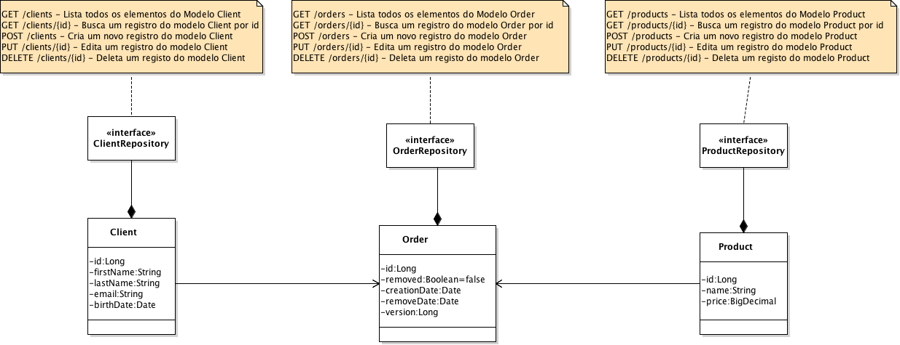

# XY-INC

## Arquitetura

- Java 1.8
- Spring Boot 1.5.3
- Spring Rest Data
- Spring Data
- H2 Database


Usando o spring-boot podemos usar o conceito de micro-service, sendo um serviço para cada módulo do sistema. Com o conceito de micro-service podemos desenvolver serviços com baixo acoplamento e alta coesão.

Para escalar o módulo poderá ser usado um loadbalance (haproxy ou nginx?), se o mesmo se encontrarem em servidores ou containers distintos.


### Diagrama



## Iniciando

Para iniciar o serviço basta executar:

### LINUX/UNIX/OSX

```
./mvnw spring-boot:run
```

### Windows

```
mvnw spring-boot:run
```

### Endereço

[http://localhost:8080/](http://localhost:8080/)